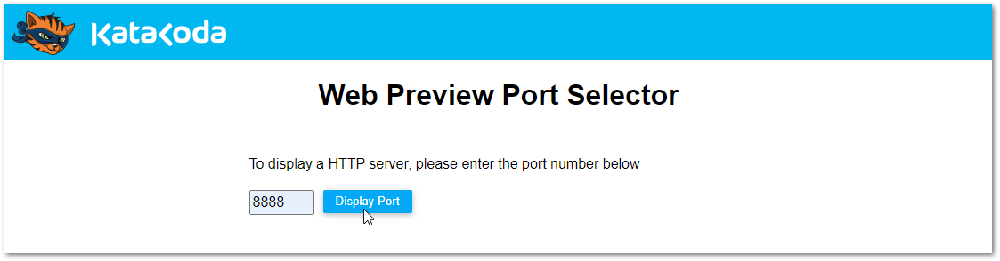

# Overview

The Docker Compose App implements the following:
- Three-Tier Architecture
  - Presentation Tier: ASP.NET Core MVC using .NET Core 3.1 LTS
  - Business Logic Tier: ASP.NET Core Web API using .NET Core 3.1 LTS
  - Data Storage Tier: MySQL database (with phpMyAdmin)
- [Docker Compose](https://docs.docker.com/compose/) for defining and running multi-container Docker applications
- [Entity Framework Core](https://docs.microsoft.com/en-us/ef/core/)
- Unit testing using [xUnit](https://xunit.net/) and [Moq](https://github.com/moq/moq4#moq)

## Run the Docker Compose App

**Steps**
1. Navigate to: https://www.katacoda.com/courses/container-runtimes/what-is-a-container
2. Select `START SCENARIO`.
3. Run the following commands in the terminal:
	```bash
	git clone https://github.com/portfolio-site-demo/interview.git
	cd interview/PortfolioSiteExample/PortfolioSiteExample.DockerComposeApp
	docker-compose up
	```
4. Wait several minutes for Docker Compose to generate multiple application containers:
   - MySQL Database
   - phpMyAdmin
   - PortfolioSiteExample.Api
   - PortfolioSiteExample.Frontend
5. Once the containers are running, select the `+` (plus) sign at the top of the terminal and then select `View HTTP port 80 on Host 1`.
   
   

   The Docker Compose App displays the output for each question and answer.

   

6. To view the database in phpMyAdmin, select the `+` (plus) sign at the top of the terminal and then select `Select port to view on Host 1`.

   

7. Enter port `8888` to display phpMyAdmin.

   

8. Log in using: root/secret.

   

9. Select the **Example** database, and then the **Records** table to see the database records.

   

10. Select the **Answers** table to see the persisted output result set.

    

## Technical Details

Here is the request flow from the front end:
1. The HTTP request calls `Index()` in [HomeController.cs](https://github.com/portfolio-site-demo/interview/blob/master/PortfolioSiteExample/PortfolioSiteExample.DockerComposeApp/PortfolioSiteExample.Frontend/Controllers/HomeController.cs).
2. The questions are added to `answerRequest` and sent to `GetAnswers()` in [DataRequestService.cs](https://github.com/portfolio-site-demo/interview/blob/master/PortfolioSiteExample/PortfolioSiteExample.DockerComposeApp/PortfolioSiteExample.Frontend.Services/DataRequestService.cs).
3. `SendPostRequest()` sends the API POST request with the JSON request object in [NetworkRequestService.cs](https://github.com/portfolio-site-demo/interview/blob/master/PortfolioSiteExample/PortfolioSiteExample.DockerComposeApp/PortfolioSiteExample.Frontend.Services/NetworkRequestService.cs).
4. `GetAnswers()` handles the API request in [ApiDataController.cs](https://github.com/portfolio-site-demo/interview/blob/master/PortfolioSiteExample/PortfolioSiteExample.DockerComposeApp/PortfolioSiteExample.Api/Controllers/ApiDataController.cs).
5. `GetAnswers()` implements the service logic in [DataProcessingService.cs](https://github.com/portfolio-site-demo/interview/blob/master/PortfolioSiteExample/PortfolioSiteExample.DockerComposeApp/PortfolioSiteExample.Api.Services/DataProcessingService.cs).
6. `GetAnswers()` returns an `AnswerResponse` object with the reponse data.
7. The `AnswerResponse` object is passed back through the chain of requests to Step 1.
8. `Index()` passes `answerResponse` to the view in [HomeController.cs](https://github.com/portfolio-site-demo/interview/blob/master/PortfolioSiteExample/PortfolioSiteExample.DockerComposeApp/PortfolioSiteExample.Frontend/Controllers/HomeController.cs).
9. [Index.cshtml](https://github.com/portfolio-site-demo/interview/blob/master/PortfolioSiteExample/PortfolioSiteExample.DockerComposeApp/PortfolioSiteExample.Frontend/Views/Home/Index.cshtml) renders to the browser.

The following service logic is implemented in [PortfolioSiteExample.Api.Services/DataProcessingService.cs](https://github.com/portfolio-site-demo/interview/blob/master/PortfolioSiteExample/PortfolioSiteExample.DockerComposeApp/PortfolioSiteExample.Api.Services/DataProcessingService.cs):
1. `GetAnswers()` takes a `AnswerRequest` parameter with instructions to retrieve the answers to each question.
2. `GetAnswers()` calls `GetAnswer()` for each question.
3. If the records have not yet been inserted into the database:
   1. Load the records into memory and serialize the JSON into C# objects.
      - Note: The JSON was converted from to C# using https://json2csharp.com.
   2. Persist the records to the database.
4. `GetAnswer()` uses LINQ to find the answer to each question.
5. If the answers have not yet been inserted into the database, add them to the table.

## Opportunities for Improvement

- Implement the front end using Angular, React, React Native, Vue.js, etc.
- Implement API authentication/authorization using API keys, JWTs, and/or certificates.
- Change the API endpoint implementation to use [GraphQL](https://graphql.org/) for more query flexibility.
- Use a segmented bulk SQL data insert for greater efficiency.
- Use the stored values in the `Answers` table as a response cache.

## References

- https://phoenixnap.com/kb/mysql-docker-container
- https://dbschema.com/2020/03/31/how-to-run-mysql-in-docker/
- https://stackoverflow.com/questions/34779894/executing-sql-scripts-on-docker-container
- https://code-maze.com/mysql-aspnetcore-docker-compose/
- https://code-maze.com/aspnetcore-app-dockerfiles/
- https://serverfault.com/questions/796762/creating-a-docker-mysql-container-with-a-prepared-database-scheme
- https://github.com/lindycoder/prepopulated-mysql-container-example
- https://github.com/IvoNet/docker-mysql