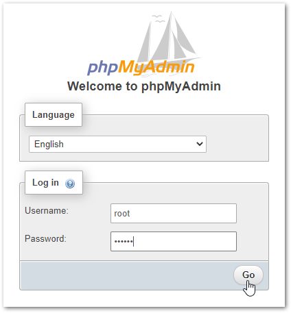

# Introduction

TODO

## Run the Console App

Run the following commands on your local machine in the terminal:
```bash
git clone https://github.com/portfolio-site-demo/interview.git
cd interview/PortfolioSiteExample/PortfolioSiteExample.ConsoleApp
dotnet run
```

**Optional:** Run the Console App using Katacoda
1. Navigate to: https://www.katacoda.com/courses/container-runtimes/what-is-a-container
2. Select `START SCENARIO`.
3. Install .NET Core 3.1 by running the following commands in the terminal:
	```bash
	sudo apt-get install -y gpg
	wget -qO- https://packages.microsoft.com/keys/microsoft.asc | gpg --dearmor > microsoft.asc.gpg
	sudo mv microsoft.asc.gpg /etc/apt/trusted.gpg.d/
	wget -q https://packages.microsoft.com/config/ubuntu/19.04/prod.list
	sudo mv prod.list /etc/apt/sources.list.d/microsoft-prod.list
	sudo chown root:root /etc/apt/trusted.gpg.d/microsoft.asc.gpg
	sudo chown root:root /etc/apt/sources.list.d/microsoft-prod.list
	sudo apt-get install -y apt-transport-https
	sudo apt-get update
	sudo apt-get install -y dotnet-sdk-3.1
	```
4. Run the Console App:
	```bash
	git clone https://github.com/portfolio-site-demo/interview.git
	cd interview/PortfolioSiteExample/PortfolioSiteExample.ConsoleApp
	dotnet run
	```

## Console App - Example Output

```
What is the count of individuals over the age of 50?
55

Who is last individual that registered who is still active?
Wolf, Ramsey

What are the counts of each favorite fruit?
strawberry: 31
apple: 38
banana: 31

What is the most common eye color?
blue

What is the total balance of all individuals combined?
$261,601.15

What is the full name of the individual with the id of 5aabbca3e58dc67745d720b1 in the format of lastname, firstname?
Saunders, Lourdes
```

## Run the Docker Compose App

**Steps**
1. Navigate to: https://www.katacoda.com/courses/container-runtimes/what-is-a-container
2. Select `START SCENARIO`.
3. Run the following commands in the terminal:
	```bash
	git clone https://github.com/portfolio-site-demo/interview.git
	cd interview/PortfolioSiteExample/PortfolioSiteExample.DockerComposeApp
	docker-compose up
	```
4. Wait several minutes for Docker Compose to generate multiple application containers:
   - MySQL Database
   - phpMyAdmin
   - PortfolioSiteExample.Api
   - PortfolioSiteExample.Frontend
5. Once the containers are running, select the `+` (plus) sign at the top of the terminal and then select `View HTTP port 80 on Host 1`.
   
   

   The Docker Compose App displays the output for each question and answer.

   

6. To view the database in phpMyAdmin, select the `+` (plus) sign at the top of the terminal and then select `Select port to view on Host 1`.

   

7. Enter port 8888 to display phpMyAdmin.

   

8. Log in using: root/secret.

   

9. Select the **Example** database and then the **Records** table to see the database records.

   
